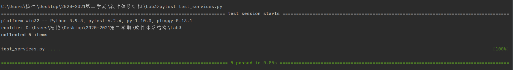
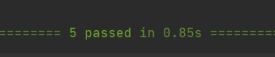

实验三: 服务层
========================

.. raw:: html

   

作者：201836900206-李康恬、201836900203-陈佳瑛、

         201836900127-杨恺、201836000121-毛科捷

.. raw:: html

   

.. raw:: html

   

日期：2021/6/12  来源：浙江师范大学

.. raw:: html

   

摘要
------

TDD是测试驱动开发（Test-Driven Development）的英文简称，是敏捷开发中的一项核心实践和技术，也是一种设计方法论。TDD的原理是在开发功能代码之前，先编写单元测试用例代码，测试代码确定需要编写什么产品代码。TDD虽是敏捷方法的核心实践，但不只适用于XP（Extreme Programming），同样可以适用于其他开发方法和过程。

本实验是实验 2 的后续。在本实验中，我们将在 services.py 中为 EnglishPal 实现一个服务层，它提供一个名为 read 的核心服务。该服务会选择合适的文章供用户阅读，该文章具备以下两个条件：

-  文章的难度级别 La 与用户的词汇级别 Lu 相匹配，条件是 La > Lu；
-  如果超过一篇文章满足 La > Lu，则选择 La 最小的一篇。

实验最后，我们成功建立服务层，完成了read的核心服务。

介绍
----

测试驱动开发
~~~~~~~~~~~~

简介
^^^^

测试驱动开发是敏捷开发中的一项核心实践和技术，也是一种设计方法论。TDD的原理是在开发功能代码之前，先编写单元测试用例代码，测试代码确定需要编写什么产品代码。TDD虽是敏捷方法的核心实践，但不只适用于XP（Extreme
Programming），同样可以适用于其他开发方法和过程。

TDD的基本思路就是通过测试来推动整个开发的进行，但测试驱动开发并不只是单纯的测试工作，而是把需求分析，设计，质量控制量化的过程。

TDD的重要目的不仅仅是测试软件，测试工作保证代码质量仅仅是其中一部分，而且是在开发过程中帮助客户和程序员去除模棱两可的需求。TDD首先考虑使用需求（对象、功能、过程、接口等），主要是编写测试用例框架对功能的过程和接口进行设计，而测试框架可以持续进行验证。

优缺点
^^^^^^

优点：在任意一个开发\ `节点`_\ 都可以拿出一个可以使用，含少量bug并具一定功能和能够发布的产品。

缺点：增加代码量。测试代码是系统代码的两倍或更多，但是同时节省了调试程序及挑错时间。

.. _节点: https://baike.baidu.com/item/节点

EnglishPal
~~~~~~~~~~

本实验是实验 2 的后续。在本实验中，我们将在 services.py 中为 EnglishPal
实现一个服务层，它提供一个名为 read
的核心服务。该服务会选择合适的文章供用户阅读。

函数 read
将以下四个参数作为输入，如果用户已成功分配要阅读的文章，则返回文章 ID。

-  用户：一个用户对象。类 User 在 model.py 中定义。
-  用户仓库：一个 UserRepository 对象。 UserRepository 类在
   repository.py 中定义。
-  文章仓库：一个 ArticleRepository 对象。类 ArticleRepository 在
   repository.py 中定义。
-  会话：一个 SQLAlchemy 会话对象。
   如果用户没有正确的用户名或正确的密码，函数 read(user, user repo,
   article repo, session) 会引发 UnknownUser
   异常，或者如果文章存储库中没有文章，即article_repo，或难以找到与用户的词汇水平相匹配的难度的文章，就会引发
   NoArticleMatched 异常。

我们说一篇文章的难度级别La与用户的词汇级别Lu相匹配，条件是La>Lu。如果超过一篇文章满足La>Lu，则选择La最小的一篇。
一篇文章的难度等级记录在数据库表articles的level字段中。一个用户的词汇水平定义为该用户新词列表（记录在数据库表newwords中）前n个最难词的平均值，其中n为3或表中属于该用户的新词数新词，以较小者为准。有关四个数据库表中的字段，即用户、阅读、文章和新词，参阅实验
2 讲义。

为简单起见，我们只考虑以下字典中的单词，其中的值代表这些单词的难度级别。

.. code:: python

   # word and its difficulty level
   WORD_DIFFICULTY_LEVEL = {'starbucks':5, 'luckin':4, 'secondcup':4, 'costa':3, 'timhortons':3, 'frappuccino':6}

工具与方法
------------

工具
~~~~~~~~

-  SQLAlchemy

-  PyCharm

方法
~~~~~~~~

下载以下六个代码
^^^^^^^^^^^^^^^^^^^^^

   -  orm.py 
   -  model.py
   -  repository.py
   -  services.py
   -  conftest.py
   -  test services.py

阅读学习代码
^^^^^^^^^^^^^^

修改service.py以完成测试
^^^^^^^^^^^^^^^^^^^^^^^^^^^^^^^

.. code:: python

   def read(user, user_repo, article_repo, session):
       admit_user=user_repo.get(user.username)     # 获取用户登录名
       # 如果用户名为空或密码错误或用户名不存在，则抛出用户异常
       if admit_user is None or admit_user.password!=user.password or admit_user.username!=user.username:
           raise UnknownUser
       difficult=0
       number=0
       for word in session.query(model.NewWord).filter_by(username=user.username).all():
           difficult+=WORD_DIFFICULTY_LEVEL[word.word]
           number+=1
       difficult/=number                           # 获取用户的词汇级别Lu的值
       articles=session.query(model.Article).all()
       best=articles[0]
       # 选择合适的文章
       for i in articles:
           if (i.level>difficult)and(best.level>i.level):
               best=i
       if(best.level>difficult):
           article=best
       else:
           # 如果文章存储库中没有文章，或者找不到与用户的词汇水平匹配的文章
           # 则抛出NoArticleMatched异常
           raise NoArticleMatched
           session.query(model.User).filter_by(username=user.username).one().read_article(article)
       session.commit()
       return article.article_id

结果
------

运行test_service.py
~~~~~~~~~~~~~~~~~~~~~~

5个测试都成功通过。

讨论
------

read功能如何成功运行？
~~~~~~~~~~~~~~~~~~~~~~

1. 我们首先获取用户登录名，如果密码错误或者用户名错误，则抛出用户异常；
2. 随后，我们获取用户的词汇列表，根据每个词的难度，计算出该用户的词汇级别Lu的值；
3. 紧接着获取文章列表，将文章的难度和Lu进行匹配，选择难度最适合的文章；
4. 如果文章存储库中没有文章，或者找不到与用户的词汇水平匹配的文章，则抛出NoArticleMatched异常；
5. 最后将合适的文章添加到用户对应的阅读记录里。

在 services.py 中的read函数是否遵循单一职责原则 (SRP) ？
~~~~~~~~~~~~~~~~~~~~~~~~~~~~~~~~~~~~~~~~~~~~~~~~~~~~~~~~~~~~~~~~~~

不是。

因为Single responsibility
principle（SRP）单一责任原则是一种计算机编程原则，它规定每个模块、类或函数都应该对软件的单一责任提供功能，并且该责任应该完全由类封装。它的所有服务都应严格配合这一责任。即，将不同的职责分离到单独的类中。SRP将职责（Responsibility）定义为
“一个变化的原因（a reason for
change）”。如果你能想出多于一种动机来更改一个类，则这个类就包含多于一个职责。

在read函数中，我们耦合了三个职责：

1. 用户登录判断；
2. 实现匹配用户词汇级别Lu和文章难度La，选择最合适的文章供用户阅读；
3. 数据传输。

因此在 services.py 中的read函数不遵循单一职责原则 (SRP) 。

TDD的优缺点
~~~~~~~~~~~~~~~~~~~~~~

通过实验我们发现TDD在此次开发时是很有帮助的，它具有以下几个优点：

1. 编出来的程序是自带测试的，可靠性好，缺陷少；
2. 能大大减少debug的需要，尤其减少单步调试，从这里能节约时间。

但是也并不是所有的开发都能够使用TDD，因为它还具有以下几个缺点：

1. 自动化程度低：TDD要求先编写测试代码再编写产品代码，这个编码顺序决定了难以利用工具来生成测试代码。当然，工具也不可能根据测试代码来生成产品代码。如果首先编写产品代码，工具则可以自动生成大部分测试代码，人工一般只需要设定用例的输入输出就可以了。测试代码的编写工作量是很大的。
2. 干扰编程思维：TDD过程中，编写测试代码大概占用一半时间，而且与编写产品代码交替进行，难免影响编程思维的连贯性。当遇到难题，测试工作卡住时，对开发思维的干扰就更大了。

参考资料
----------

-  百度百科：\ `TDD（测试驱动开发(Test-Driven Development)）`_
-  博客园：\ `单一职责原则（Single Responsibility Principle）`_

.. _TDD（测试驱动开发(Test-Driven Development)）: https://baike.baidu.com/item/TDD/9064369
.. _单一职责原则（Single Responsibility Principle）: https://www.cnblogs.com/gaochundong/p/single_responsibility_principle.html
